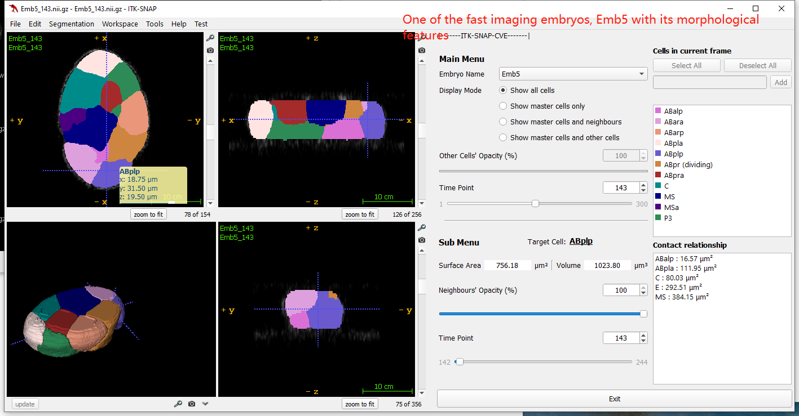

# [arXiv] EmbSAM: Cell boundary localization and Segment Anything Model for 3D fast-growing embryos
<br>_Cunmin Zhao<sup>#</sup>, Zelin Li<sup>#</sup>, Yixuan Chen, Ming-Kin Wong, Lu-Yan Chan, Hong Yan, Chao Tang, Guoye Guan<sup>\*</sup>, Zhongying Zhao<sup>\*</sup>_<br>
In [arXiv]  
<sup>#</sup> Equal contribution,
<sup>*</sup> Correspondence Author.

**Motivations**: Fluorescence imaging on cell membranes would exhibit a low signal-to-noise ratio (SNR) under common experimental conditions. As embryonic development involves cell deformation, migration, division, and differentiation as fast as seconds to minutes, customized fluorescence imaging at high temporal resolution requests a weak laser intensity to limit photobleaching and phototoxicity, leading to a low SNR that impedes three-dimensional (3D) shape reconstruction across cellular to organismic scales.  
**Results**: We devised a computational framework, *EmbSAM*, which incorporates a deep-learning-based cell boundary localization algorithm and the Segment Anything Model. With the nematode Caenorhabditis elegans embryos, *EmbSAM* outperforms the latest cell segmentation tools and rebuilds all the 3D cell shapes up to the gastrulation onset at 10-second intervals. The outputted data can clearly illustrate cell shape changes related to cell division, body axis establishment, and cell migration.  


## Overview
      


**Fig. 1. The flowchart of *EmbSAM***
## Get Started
### Dependencies and Installation
- Python 3.11.0
- Pytorch 2.0.1

1. Create Conda Environment
```
conda create --name EmbSAM python=3.11.0
conda activate EmbSAM
conda install anaconda::git
```
2. Clone Repo
```
git clone https://github.com/cuminzhao/EmbSAM.git
```
3. Install Dependencies
```
cd EmbSAM
pip install -r ./requirement.txt
```

### Dataset
You can refer to the following links to download the datasets of raw cell membrane fluorescence 
[Emb1_Raw.zip](https://drive.google.com/file/d/1fhibykMJlrw4nmvUBC4-udaZ7DD_hJsR/view?usp=drive_link), 
[Emb2_Raw.zip](https://drive.google.com/file/d/1MlTaSvqbzdlmPGuQnI1u-tBsijZ90-Ai/view?usp=drive_link),
[Emb3_Raw.zip](https://drive.google.com/file/d/1-XZEgDTAGpfzYIQAEYwBEec61fVqED-L/view?usp=drive_link),
[Emb4_Raw.zip](https://drive.google.com/file/d/14ooRaOu3DAUas6G5JDoWaFzD7stAktxP/view?usp=drive_link) and 
[Emb5_Raw.zip](https://drive.google.com/file/d/1iCCUHcyinFcd5TyygteVdoMb8-r7JKc2/view?usp=drive_link)


### Pre-trained Model
the pre-trained models of this project can be downloaded here
- The model_parameters with Segment Anything Model(vit_b) and the image denosing module trained on X_axis, Y_axis and Z_axis [[model_parameters](https://drive.google.com/drive/folders/1vNp7KypEOxTXCxHLS6N4kET1M_cfBtup?usp=drive_link)]. You need to download these parameters and put them into model_parameters.
* **Structure of model_parameters**: 
    ```buildoutcfg
    model_parameters/
      |--Z_axis.pth
      |--Y_axis.pth
      |--X_axis.pth
      |--sam_vit_b_01ec64.pth
    ```

### Test  
**Example**: to run *EmbSAM* with Emb1_Raw, you need to keep these data in
* **Structure of data folder**: 
    ```buildoutcfg
    data/
      |--Emb1_Raw/*.tif
    ```
* **Structure of confs folder**:  
  The Emb1_CellTracing.csv is the tracing result of cell nucleus fluorescence, saved in confs.
    ```buildoutcfg
    confs/
      |--Emb1_CellTracing.csv
      |--running_Emb1.txt
      ...
      |--other running confs
    ```
Then run
```
python EmbSAM.py -cfg_path ./confs/running_Emb1.txt
```

you will get your result in 
```
./output_folder/result
```

## Provided Data
* All the 5 embryo samples processed in this paper are digitized into the format customized to our visualization software *ITK-SNAP-CVE* from [CMap](https://doi.org/10.1101/2023.11.20.567849), and can be downloaded [online](https://doi.org/10.6084/m9.figshare.24768921.v2).  

* The effective visualization is shown below:

    *    

## Acknowledgement
- The design of the segmentation algorithm is inspired by [CShaper](https://github.com/cao13jf/CShaper) and [MedLSAM](https://github.com/openmedlab/MedLSAM).
- A part of code is modified from [llflow](https://github.com/wyf0912/LLFlow).
- We thank Meta AI for making the source code of [segment anything](https://github.com/facebookresearch/segment-anything) publicly available.
